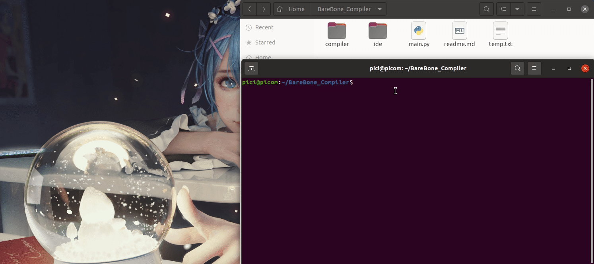

# Bare Bone simple IDE

## What is Bare Bone?
The Bare Bone language is **a programming language with a minimal set of operations that exhibits universal computation**
To put it another way, Bare Bone programming language is Turing complete. Its data manipulation rules can be used to simulate any Turing machine. 
## Bare Bone spectification 

  
Click to expand!

### Comments

In this implementation, a '#' character introduces a comment, which continues to the end of the source line.

### Reserved words

The words in the following list are reserved, and may not be used as identifiers:

-   clear
-   copy
-   decr
-   do
-   end
-   incr
-   not
-   to
-   while

Reserved words are case-insensitive.

### Identifiers

Identifiers must begin with an alphabetic character, and may contain alphabetic, numeric, and underscore characters. Identifiers are case-insensitive, thus "FOO", "Foo", and "foo" are the same identifier. Reserved words my not be used as identifiers.

### Variables

In Bare Bones, variables are named by an identifier and may contain any arbitrarily large non-negative integer values. This implementation is currently limited to the size of the host C compiler's uintmax_t type, which typically is 2^64-1.

### I/O

Bare Bones does not provide any I/O facilities. Input may be accomplished by initializing variables before program execution using either command-line options or an initialization section, or by using the "clear" and "incr" statements in the program.

Output consists of the state of variables when the program halts. This implementation will print the variable names and contents to standard output.

### Statements

| statement | effect |
| --------- | --- |
| clear \<var>; | Set the variable to zero. |
| incr \<var>; | Increment the value of the variable. |
| decr \<var>; | Decrement the value of the variable, except that if the value was already zero, it remains zero. |
| while \<var> not 0 do;   \<statements>    end; | Loop while the variable's value is not zero. May contain one or more statements, including nested while loops. If the statements do not alter the value of the loop variable, the loop will never terminate. |
| copy \<var> to \<var>; | Copy one variable to another, preserving value of original. |

### Source 

[BareBoneSummary](http://www.brouhaha.com/~eric/software/barebones/bare_bones_language_summary.html)

## Demo

## Compiler

  

### Knowledge

  

### Lexer

  

### Parser

  

### Codegenner	

  

### Coderunner

  

## IDE - actually just text editor

  

### Source:

  

[original version](https://github.com/Proxlight/Text-Editor)